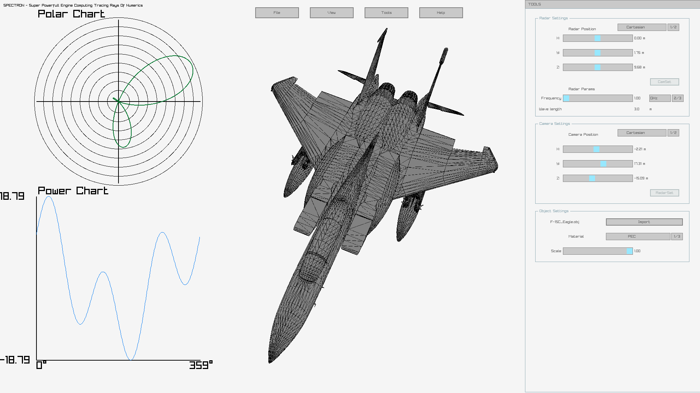

# SPECTRON - Super Powerfull Engine Computing Tracing Rays Of Numerics

## Introduction

SPECTRON is a program for measuring the RCS (Radar Cross Section) of physical objects (named targets). It is project for master degree. The main porpose is to analize & visiual data in dynamic enviroment. 



## Software

The program is maintaing on operating system based on Linux kernel. However it is possible to run SPECTRON on Windows (64-bit & 32-bit). 

## How to get?

Obtaing software by cloning:

```bash
git clone https://github.com/Jamro90/SPECTRON.git
```

Building a software from code is simple, just run in terminal:

```bash
cd SPECTRON/src
make 
```

if you use Linux & need Windows executable building for Windows 64-bit architecture

```bash
cd SPECTRON\src
make win64
```

and Windows 32-bit

```bash
cd SPECTRON\src
make win32
```

